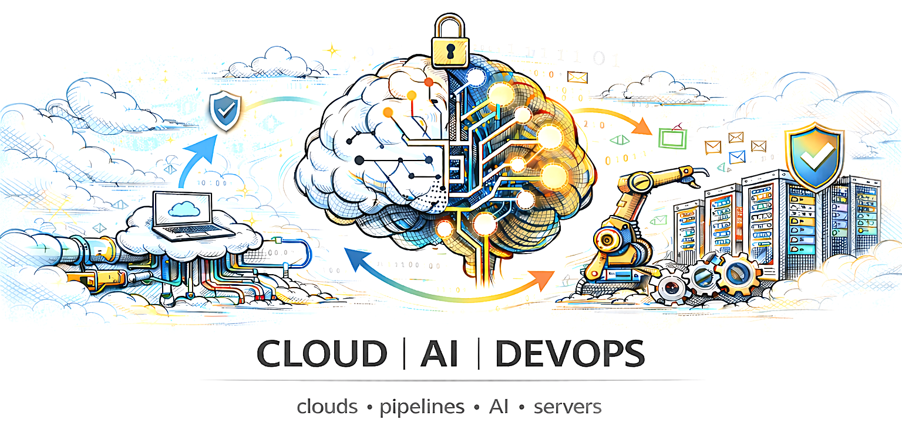

<!-- HERO BANNER -->

  

<h1 align="center">☁️ Cloud | 🤖 AI | 🚀 DevOps</h1>

  Building scalable systems • Automating everything • Applying AI to real-world problems

---

## 👨‍💻 About Me

I’m a **Cloud, AI, and DevOps enthusiast** focused on building **end-to-end systems** —  
from infrastructure → automation → intelligence.

- ☁️ Cloud Architecture & Services  
- 🚀 CI/CD & DevOps Automation  
- 🤖 AI / ML Integration  
- 🧠 Continuous Learning & Experimentation  

---

## 🌐 End-to-End System View

  

**Flow:**  
Code → CI/CD → Cloud Infrastructure → Monitoring → AI Intelligence

---

## ☁️ Cloud Stack

  

- AWS / Azure / GCP  
- Compute, Storage, Networking  
- Security & IAM  
- Cost Optimization  

---

## 🚀 DevOps Stack

  

- Git & GitHub  
- Docker & Kubernetes  
- CI/CD Pipelines  
- Infrastructure as Code  

---

## 🤖 AI & Automation

  

- Machine Learning Basics  
- AI APIs & Automation  
- Intelligent Monitoring  
- Data-Driven Decisions  

---

## 🛠 Tools & Technologies

  

---

## 📌 What I’m Working On

- 🔧 Cloud automation projects  
- 📦 Containerized applications  
- 🤖 AI-powered DevOps workflows  
- 📊 Monitoring & optimization systems  

---

## 🌱 Learning Philosophy

> **Build → Break → Fix → Learn → Scale**

---

## 📫 Connect With Me

  
  

---

  ⭐ If you like this profile, give it a star!

